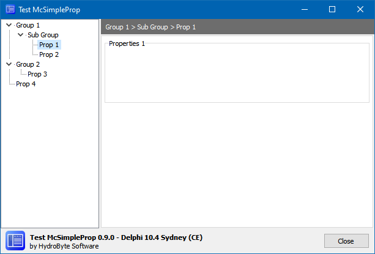
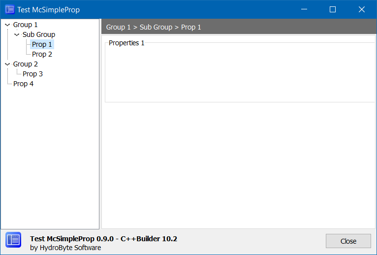

# McSimpleProp
A **Delphi / Lazarus / C++Builder** simple and small class to manage properties nested within tabs of a `TPageControl` and a navigation control using a `TTreeView`. 

 

## Motivation
* Simple Object-Pascal native code.
* Just one unit (`McSimpleProp`), just one class(`TMcSimpleProp`).
* Not a visual component; just an unit and simple class.
* Compatible (aimed):
   * Delphi 7 up to now.
   * Lazarus.
   * C++Builder 2006 up to now.
* Tested with:
   * Delphi 10.4 (CE)
   * Lazarus 2.3.0 (FPC 3.2.2)

## How to use it
See [test](https://github.com/hydrobyte/McSimpleProp/tree/main/test) folder for structured examples.

Add `McSimpleProp` unit to your project.

Into a `TForm` or a `TFrame` descendant unit, add a `TTreeView` and a `TPageControl` similar to this layout:



Into the designer, add pages to `TPageControl` and setup each TTabSheet's `Caption` property using names that will be shown into the `TTreeView` navigator. You can create a special tab with `PageIndex = 0` to be shown as a Group node.

Into your code, add some nodes associated with tabs. You can use `aNode = nil` and `isParent = false` to create Groups of nested Properties.

```pascal
procedure TFormMain.FormCreate(Sender: TObject);
var
  node: TTreeNode;
begin
  // McSimpleProp setup
  fMcSimpleProp := TMcSimpleProp.Create(TreeView, PageControl);
  // ... add nodes
  node := fMcSimpleProp.AddNode('Group 1'   , nil , false);
  node := fMcSimpleProp.AddNode(Tab1.Caption, node, true );
  node := fMcSimpleProp.AddNode('Group 2'   , nil , false);
  node := fMcSimpleProp.AddNode(Tab2.Caption, node, true );
  node := fMcSimpleProp.AddNode(Tab3.Caption, nil , false);
  // ... prepare controls
  fMcSimpleProp.Prepare;
  // ... select node related to Tab1 by default
  fMcSimpleProp.SelectNodeByText(Tab1.Caption);
end;
```

In order to respond to the user selection on the navigator, create a `TTreeView`'s `OnChange` event handler.
```pascal
procedure TFormMain.TreeViewChange(Sender: TObject; Node: TTreeNode);
begin
  fMcSimpleProp.SelectTabByText(Node.Text);
  LbHeader.Caption := fMcSimpleProp.GetNodePath(Node);
end;
```   

The `TLabel` component showing the `path` is optional.